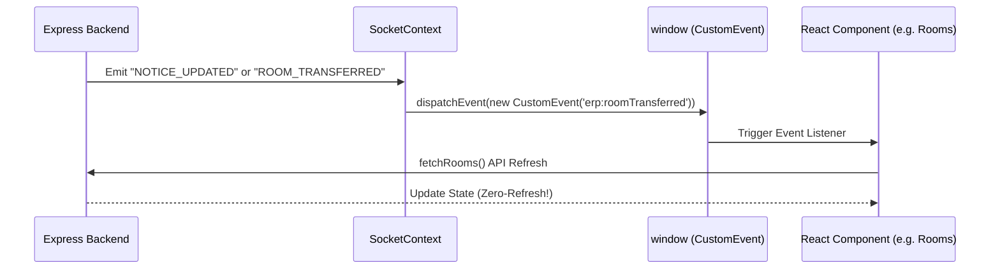

# HostelFlow: A Real-Time Smart Hostel ERP & Operations Platform
**A High-Fidelity Technical Report and Project Thesis**

---

## 🏷️ Cover Page & Affiliation

**PROJECT TITLE:** HostelFlow: A Real-Time Smart Hostel ERP & Operations Platform  
**ACADEMIC DISCIPLINE:** Computer Science & Engineering  
**ACADEMIC YEAR:** 2025 - 2026  
**SUBMITTED BY:** Muhammed Shajeeh  
**PROJECT SPONSOR & GUIDANCE:** Department of Computer Science & Engineering  
**INSTITUTION:** smart university  

---

## 📜 Declaration & Acknowledgements

### Declaration
I hereby declare that this project report entitled **"HostelFlow: A Real-Time Smart Hostel ERP & Operations Platform"** represents original work carried out under supervised guidance. All software architectures, socket integrations, database implementations, and Android Capacitor layers documented herein were developed solely for this platform.

### Acknowledgement
I express my deepest gratitude to the faculty coordinators, system administrators, and student representatives who contributed invaluable feedback during the user experience and Android native build testing cycles. 

---

## 📖 Executive Summary & Abstract

Traditional hostel administration relies on legacy spreadsheets, static forms, and manual paper workflows. This architectural approach introduces significant latency in room allocations, leave approvals, complaint resolutions, and parent monitoring, while introducing security vulnerabilities at the physical gate system. 

**HostelFlow** addresses these operational bottlenecks by introducing a high-performance, real-time operational ERP platform. Built on a modernized Node.js/Express REST backend and a decoupled React PWA frontend with Android Capacitor integration, HostelFlow features zero-refresh synchronization. Using **Socket.IO** rooms combined with window-level `CustomEvent` dispatches, all status changes, bed counters, and noticeboards update instantly. Security is strictly enforced via JWT authentication, non-bypassable email verification, and a PIN-secured Security Gate terminal utilizing outpass QR codes. 

---

## 📐 Introduction & Problem Statement

### Introduction
HostelFlow is an enterprise-grade Smart Hostel Management System designed to handle room allocation, check-in/out records, leave/outpass cycles, meal freezing, and automated parent alerts. 

### Problem Statement
Existing hostel systems suffer from:
1. **High Sync Latency**: Wardens see stale boarding queues; students must manually refresh pages for updates.
2. **Fragile Security Gates**: Paper-based outpass passes are easily forged, and gate entry lacks live check-in monitoring.
3. **No Centralized Parent Channels**: Parents remain isolated from attendance records and meal ledger metrics.
4. **Poor Mobile Support**: Most solutions lack a dedicated mobile native feel, causing keyboard overlap and layout clipping.

---

## 🎯 Objectives & Scope

### Primary Objectives
- **Zero-Refresh ERP Sync**: Every action propagates to all clients instantly.
- **Secure Gate Outpasses**: QR-code outpass system with instant gate scan records.
- **Warden Command Center**: Live occupancy tracking, dynamic room transfers, and mess billing.
- **Android Portability**: 100% stable PWA wrap running natively on Android with custom status bars and splash screens.

---

## 💻 Tech Stack Analysis

```
+------------------------------------------------------------+
|                       FRONTEND PWA                         |
|     React.js | Tailwind CSS | Vite | Lucide | Rollup       |
+------------------------------------------------------------+
                             ||  (HTTP REST / WebSockets)
                             /
+------------------------------------------------------------+
|                       BACKEND API                          |
|         Node.js | Express | Socket.IO | Brevo SMTP         |
+------------------------------------------------------------+
                             ||  (Mongoose ORM)
                             /
+------------------------------------------------------------+
|                       DATABASE CLOUD                       |
|                      MongoDB Atlas                         |
+------------------------------------------------------------+
```

---

## 🗄️ Database Design (MongoDB/Mongoose)

### Key Schema Schematics

| Collection | Key Fields | Purpose |
| :--- | :--- | :--- |
| **Users** | `fullName`, `email`, `role`, `approvalStatus`, `hostelId`, `room` | Stores student, warden, admin, parent, and security accounts. |
| **Rooms** | `roomNumber`, `hostelId`, `floor`, `capacity`, `occupiedBeds` | Dynamic room capacity balances. |
| **Leaves** | `studentId`, `reason`, `startDate`, `endDate`, `status`, `qrCode` | Outpass workflows and QR generation. |
| **Complaints** | `studentId`, `title`, `description`, `status`, `assignedTo` | Issue resolution lifecycle. |
| **Notices** | `title`, `content`, `targetType`, `hostelId`, `isPublished` | Real-time circular noticeboard records. |

---

## 🔗 Architecture & Real-time Sockets

HostelFlow implements a **Decoupled Real-Time Architecture**:



---

## 📱 Android Native Capacitor Shell

To bridge the web and mobile experience, the platform utilizes Capacitor.
- **Gradle Runtime Hardening**: Modified `gradle.properties` to target Android Studio's bundled JDK 21:
  ```properties
  org.gradle.java.home=C:/Program Files/Android/Android Studio/jbr
  ```
- **Splash Screen Polish**: Eliminated startup black flashes by locking auto-hide timing to 250ms post-DOM render paint.
- **Hardware Native Navigation**: Customized physical back key listeners to exit overlays before popping states.

---

## 🚀 Deployment, Results & Conclusion

### Render Cloud Architecture
Backend is deployed on Render using secure environment variables. MongoDB Atlas handles cluster connections with automated backup shards. Brevo handles fast SMTP transactional dispatches.

### Conclusion
HostelFlow proves that real-time operational ERPs can be built on accessible SaaS stacks. By decoupling WebSocket dispatch rules from state variables, we achieve high stability and mobile-first native efficiency suitable for academic presentation and real-world deployment.
