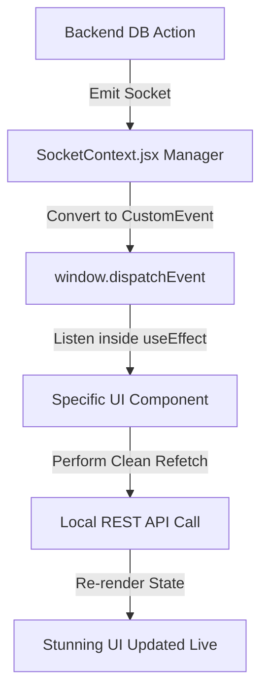

# Real-Time Socket.IO Architecture ⚡

HostelFlow runs on a zero-refresh architecture. This document explains the implementation of standard browser events for decoupled state syncing.

---

## 🔄 The Decoupled Event Flow

To prevent memory leaks and redundant websocket handshake connections inside nested React UI components, HostelFlow runs a **Symmetrical CustomEvent Loop**:

---

## 🏢 Room & Channel Partitioning

All Socket connections are secured via JWT parameters. Clients are joined to isolated channels matching their role scopes:

- **Global Broadcast Channel**: `ADMIN_GLOBAL`
- **Hostel-Specific Room**: `HOSTEL_<hostelId>`
- **Student-Specific Room**: `STUDENT_<studentId>`
- **Parent-Specific Monitoring**: `PARENT_<parentId>`

---

## 🔌 Socket Listener Specifications

| Socket Event | CustomEvent Dispatched | Triggers | Affected Pages |
| :--- | :--- | :--- | :--- |
| **`NEW_NOTICE`** | `erp:newNotice` | Realtime circular created | Notices, Noticeboard |
| **`NOTICE_UPDATED`** | `erp:noticeUpdated` | Notice content updated | Notices, Noticeboard |
| **`NOTICE_DELETED`** | `erp:noticeDeleted` | Notice soft-deleted | NoticeManagement |
| **`LEAVE_STATUS_UPDATED`** | `erp:leaveUpdated` | Leave approved/rejected | StudentDashboard, Parent |
| **`ROOM_TRANSFERRED`** | `erp:roomTransferred` | Warden reassigned bed | Rooms, StudentDashboard |
| **`STUDENT_APPROVED`** | `erp:studentApproved` | Warden onboarded candidate | PendingStudents, Rooms |
